# Guía de flujos operativos — Transporte Rosario Perez

Cómo sacarle el máximo provecho a la plataforma: qué cargar primero, en qué orden operar los viajes, cuándo crear proformas y cómo funcionan los vencimientos.

**Audiencia:** operaciones, administración y contabilidad.  
**Última actualización:** junio 2026.

---

## 1. Vista general: el ciclo de la operación

La plataforma organiza el trabajo en **cuatro capas** que conviene respetar en este orden:

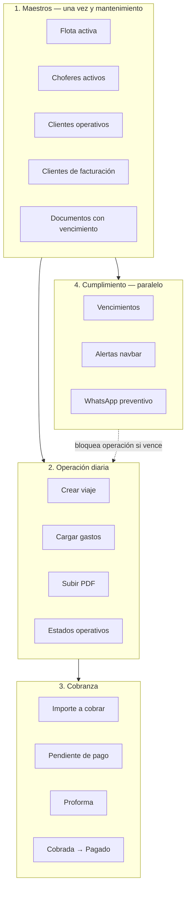

| Capa | Pantallas | Objetivo |
|------|-----------|----------|
| Maestros | Flota, Choferes, Clientes, Configuración | Tener todo listo **antes** de crear viajes |
| Operación | Viajes → ficha del viaje | Registrar el trabajo del día a día |
| Cobranza | Viaje → Facturación, Proformas | Pasar de “viaje hecho” a “plata cobrada” |
| Cumplimiento | Vencimientos, campanita, Config → Notificaciones | No operar con documentación vencida |

---

## 2. Configuración inicial (hacer una sola vez)

### 2.1 Maestros obligatorios para crear viajes

El botón **Nuevo viaje** solo se habilita si existen:

- Al menos **1 cliente operativo** (catálogo de viajes)
- Al menos **1 camión activo**
- Al menos **1 semi o acoplado activo**
- Al menos **1 chofer activo**

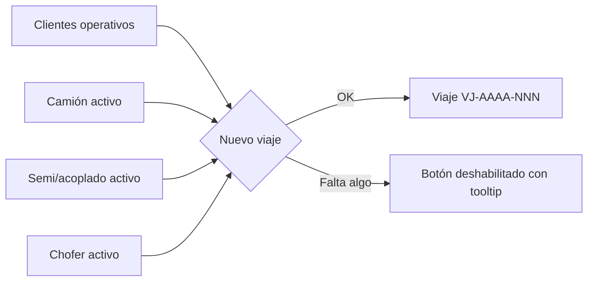

### 2.2 Dos tipos de “cliente” (importante)

| Concepto | Dónde se carga | Para qué sirve |
|----------|----------------|----------------|
| **Cliente operativo** | Clientes (catálogo de viajes / `arcor_clients`) | Se elige al **crear el viaje** — origen, destino, cuenta, etc. |
| **Cliente de facturación** | Clientes (módulo de facturación / `clients`) | Se elige al **crear la proforma** — a quién le facturás |

En la práctica pueden ser el mismo cliente con distinto registro, o el operativo ser el punto de entrega y el de facturación la razón social que paga.

### 2.3 Documentos de cumplimiento (paralelo al arranque)

Cargar en la **ficha de cada entidad**:

| Entidad | Dónde | Ejemplos |
|---------|-------|----------|
| Vehículo | Flota → detalle | VTV, RUTA, seguro |
| Chofer | Choferes → detalle | Licencia, LINTI, psicofísico, ART |
| Empresa | Configuración → Empresa | Habilitaciones, pólizas |

Cada documento puede ser:
- **Único** (`once`) — no genera alertas de vencimiento
- **Recurrente** (mensual, semestral, anual, cada 3 años) — entra al circuito de vencimientos

---

## 3. Flujo recomendado de un viaje (de punta a punta)

Este es el recorrido ideal para sacarle jugo al sistema:

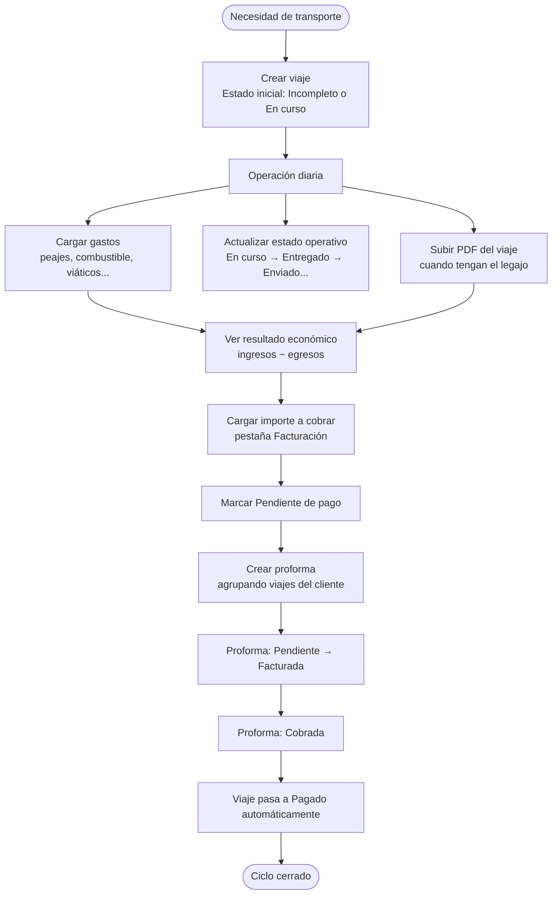

### Paso a paso con pantallas

| Paso | Dónde | Qué hacer |
|------|-------|-----------|
| 1 | **Viajes → Nuevo viaje** | Cliente operativo, camión, semi, chofer, origen/destino, tipo de carga, fechas |
| 2 | **Viaje → Gastos** | Registrar cada egreso; el total se suma solo |
| 3 | **Viaje → Operación** | Cambiar estado según avance real (ver sección 4) |
| 4 | **Viaje → Operación → PDF** | Subir el PDF consolidado del viaje (como antes) |
| 5 | **Viaje → Facturación** | Cargar **importe a cobrar** y ver si rinde o pierde |
| 6 | **Viaje → Facturación** | Botón **Marcar pendiente de pago** |
| 7 | **Proformas → Nueva** | Elegir cliente de facturación + viajes pendientes |
| 8 | **Proformas** | Cuando entra el pago: estado **Cobrada** |

---

## 4. Estados del viaje

Hay **7 estados**. Se dividen en dos grupos que **no se mezclan** desde el mismo lugar:

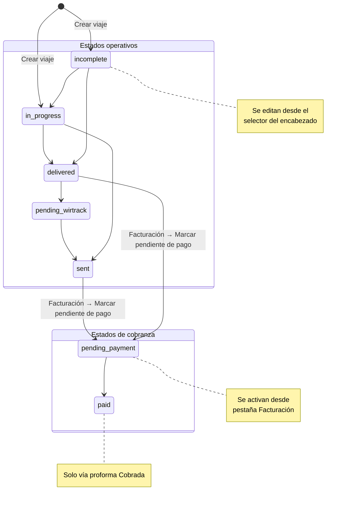

### Estados operativos (editables en el encabezado del viaje)

| Estado | Cuándo usarlo |
|--------|---------------|
| **Incompleto** | Viaje recién creado o con datos faltantes |
| **En curso** | El camión está en ruta |
| **Entregado** | Carga entregada en destino |
| **Pendiente Wirtrack** | Falta cerrar algo en el sistema del cliente |
| **Enviado** | Documentación/logística enviada al cliente |

### Estados de cobranza (solo desde Facturación / Proformas)

| Estado | Cuándo usarlo |
|--------|---------------|
| **Pendiente de pago** | Ya sabés cuánto cobrar; listo para proforma |
| **Pagado** | El cliente pagó → se setea **automáticamente** al marcar la proforma como **Cobrada** |

### Reglas del sistema

- No podés poner **Pagado** manualmente desde el selector de estado.
- No podés volver a estados operativos si el viaje ya está en **Pendiente de pago** o **Pagado**.
- Un viaje **Pagado** no permite editar importes ni gastos de facturación.

---

## 5. Subir el PDF del viaje (como antes)

El PDF del viaje es **un archivo por viaje**, guardado en DigitalOcean Spaces. El flujo es el mismo concepto que antes: adjuntar el legajo consolidado.

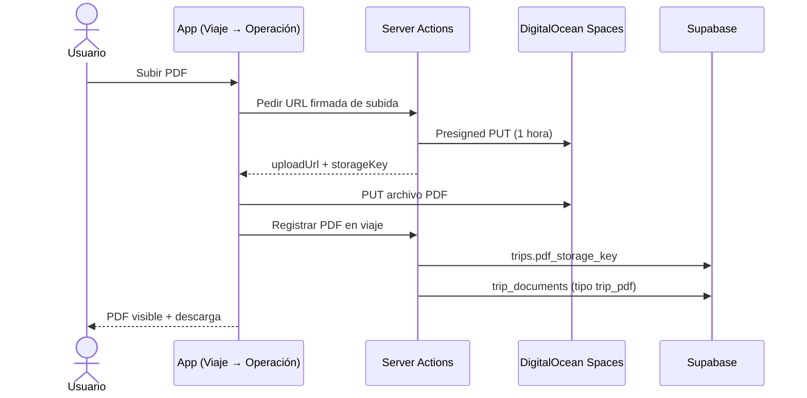

### Buenas prácticas

- Subir el PDF cuando el viaje esté **cerrado operativamente** (Entregado / Enviado).
- Podés **reemplazar** el PDF si subiste uno incorrecto.
- En el listado de viajes, el ícono PDF indica que el viaje tiene archivo.
- La descarga usa URL firmada temporal (1 hora) — no es un link público permanente.

### Diferencia con documentos de entidad

| | PDF del viaje | Documento de entidad (VTV, licencia…) |
|--|---------------|--------------------------------------|
| Dónde | Ficha del viaje → Operación | Ficha de flota/chofer/empresa |
| Propósito | Legajo del transporte | Cumplimiento legal |
| Vencimiento | No tiene alerta automática | Sí, si es recurrente |
| Storage | Mismo bucket Spaces | Mismo bucket Spaces |

---

## 6. Gastos y cálculos económicos

### Cómo se calcula el resultado del viaje

```
Resultado (profit) = Importe a cobrar − Suma de gastos
Margen % = (Resultado / Importe a cobrar) × 100   (si hay ingreso)
```

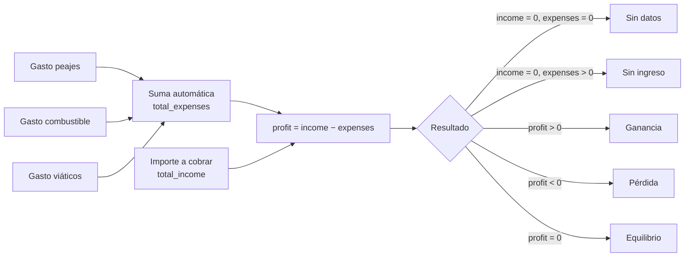

### Cuándo cargar cada cosa

| Momento | Acción |
|---------|--------|
| Durante el viaje | Ir cargando gastos en **Gastos** (cada peaje, carga de combustible, etc.) |
| Al cerrar el viaje | Revisar que no falte ningún gasto |
| Antes de cobrar | Cargar **importe a cobrar** en Facturación |
| Después de ambos | El banner de **Resultado del viaje** muestra si conviene o no |

El listado de viajes muestra un badge compacto con el resultado (Ganancia / Pérdida / Sin ingreso, etc.).

---

## 7. Proformas: cuándo y cómo crearlas

### Punto exacto en el flujo

La proforma se crea **después** de que el viaje esté en **Pendiente de pago**. No antes.

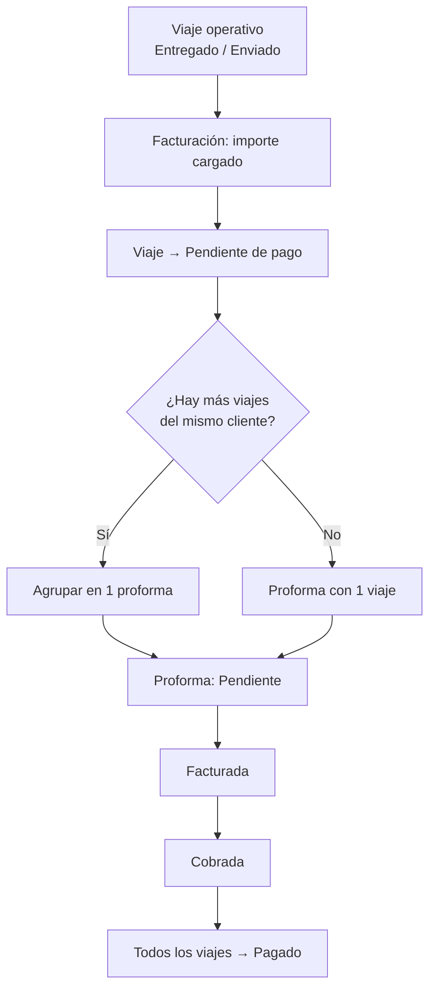

### Requisitos para incluir un viaje en proforma

- Estado del viaje = **Pendiente de pago**
- El viaje **no** está ya en otra proforma activa (Pendiente o Facturada)
- Existe al menos **1 cliente de facturación** cargado en Clientes

### Estados de la proforma

| Estado | Significado | Efecto en viajes |
|--------|-------------|------------------|
| **Pendiente** | Orden de pago enviada / esperando | Viajes siguen en Pendiente de pago |
| **Facturada** | Factura emitida al cliente | Viajes siguen en Pendiente de pago |
| **Cobrada** | El cliente pagó | **Todos los viajes de la proforma → Pagado** |

### Flujo recomendado en Proformas

1. **Proformas → Nueva proforma**
2. Elegir **cliente de facturación**
3. Seleccionar viajes **pendientes de pago** (el picker solo muestra los disponibles)
4. Cargar **importe** e **impuestos** por línea de viaje
5. Guardar → proforma en **Pendiente**
6. Cuando facturás al cliente → **Facturada**
7. Cuando el pago entra → **Cobrada** (esto cierra el ciclo económico)

### Facturas (invoices)

La tabla de facturas existe y se muestra en la ficha del viaje, pero **hoy no hay emisión AFIP desde la app**. La operatoria de cobro se canaliza por **proformas**.

---

## 8. Vencimientos de documentos

### Qué entra al circuito de alertas

Solo documentos de entidad con:

- Frecuencia **recurrente** (no “Único”)
- **Fecha de vencimiento** cargada
- Versión **actual** (`is_current = true`)

### Cómo se calcula el estado

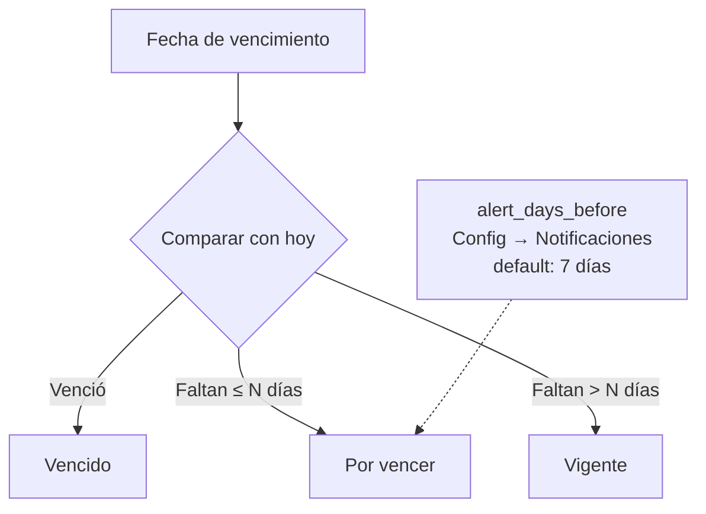

Fórmula simplificada:

```
días_restantes = fecha_vencimiento − hoy (en días calendario)

Si días_restantes < 0        → Vencido
Si días_restantes ≤ N        → Por vencer   (N = días de anticipación)
Si días_restantes > N        → Vigente
```

### Dónde se ven las alertas

| Canal | Qué muestra | Cuándo |
|-------|-------------|--------|
| **Campanita (navbar)** | Vencidos + por vencer | Siempre al usar la app |
| **Vencimientos** (`/app/documentos`) | Listado completo con filtros | Cuando querés renovar |
| **WhatsApp** | Solo **por vencer** (preventivo) | Cron diario ~08:00 ART |
| **Dashboard** | Contadores de alertas | Al entrar |

### Hitos de WhatsApp (máx. 2 avisos por documento)

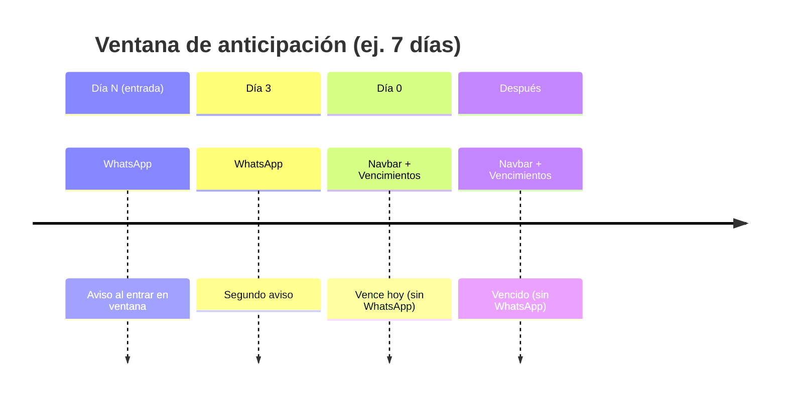

- **WhatsApp no avisa documentos ya vencidos** — solo preventivo.
- La **campanita sí muestra vencidos** para que los renueven.

### Cómo renovar un documento

1. Ir a **Vencimientos** o a la ficha de la entidad
2. Clic en **Renovar**
3. Cargar nueva fecha de emisión/vencimiento y archivo (opcional)
4. La versión anterior queda en **historial**; la nueva es la vigente

---

## 9. Rutina operativa recomendada

### Diaria (operaciones)

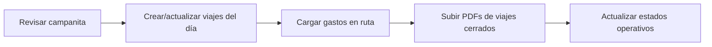

- [ ] Revisar **campanita** de vencimientos
- [ ] Crear viajes nuevos o actualizar los en curso
- [ ] Cargar **gastos** del día
- [ ] Subir **PDFs** de viajes terminados
- [ ] Pasar estados a **Entregado** / **Enviado**

### Semanal (administración)

- [ ] Cerrar viajes con **importe a cobrar** definido
- [ ] Pasar a **Pendiente de pago** los listos para facturar
- [ ] Armar **proformas** agrupando por cliente
- [ ] Revisar **Vencimientos** y renovar documentos
- [ ] Mirar **Dashboard / Reportes** (márgenes, viajes pendientes)

### Al cobrar (contabilidad)

- [ ] Confirmar pago del cliente
- [ ] Marcar proforma como **Cobrada**
- [ ] Verificar que los viajes pasaron a **Pagado**
- [ ] Revisar resultado económico en reportes

---

## 10. Inventario (si lo usan)

Flujo paralelo al de viajes:

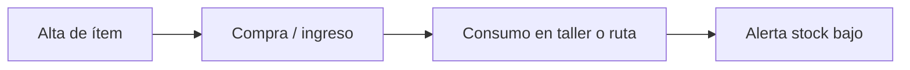

- **Inventario → ítems**: repuestos, lubricantes, etc.
- **Movimientos**: compra (suma), consumo (resta), ajuste
- El dashboard alerta cuando el stock está bajo el mínimo

No está acoplado automáticamente a los gastos del viaje — si compran algo para un viaje, conviene cargarlo en **ambos** lugares si quieren trazabilidad completa.

---

## 11. Mapa de pantallas por rol

| Rol | Pantallas principales | Foco |
|-----|----------------------|------|
| **Operaciones** (`ops`) | Viajes, Flota, Choferes, Vencimientos, Inventario | Crear viajes, gastos, PDFs, estados |
| **Contabilidad** (`accounting`) | Proformas, Reportes, Clientes | Proformas, cobranza, KPIs |
| **Admin** (`admin`) | Todo + Configuración | Maestros, alertas, empresa |
| **Superadmin** | Todo | Igual que admin hoy |

> Los roles filtran el menú. Para producción con varios usuarios, validar permisos en servidor (ver checklist de producción).

---

## 12. Errores comunes y cómo evitarlos

| Problema | Causa | Solución |
|----------|-------|----------|
| No puedo crear viaje | Faltan maestros | Cargar cliente operativo, camión, semi, chofer activos |
| No aparece en proforma | Viaje no está en Pendiente de pago | Facturación → Marcar pendiente de pago |
| Viaje no aparece en picker | Ya está en otra proforma activa | Cerrar o cobrar la proforma anterior |
| No puedo cambiar estado | Viaje en cobranza | Gestionar desde Facturación / Proformas |
| Resultado “Sin ingreso” | Hay gastos pero no importe a cobrar | Cargar importe en Facturación |
| Documento no alerta | Marcado como “Único” | Usar frecuencia recurrente + fecha vencimiento |
| WhatsApp no llega | Alertas off o sandbox | Config → Notificaciones + proveedor prod |
| PDF no sube | Spaces mal configurado | Revisar `DO_SPACES_*` en entorno |

---

## 13. Resumen en una frase

> **Maestros → Viaje → Gastos + PDF → Facturación → Proforma → Cobrada**, mientras **Vencimientos** corre en paralelo para no operar con documentación vencida.

---

## Referencias

| Tema | Archivo / ruta |
|------|----------------|
| Checklist de producción | [`CHECKLIST-PRODUCCION.md`](CHECKLIST-PRODUCCION.md) |
| Estados de viaje | `lib/types.ts` → `tripStatusLabels` |
| Cálculo económico | `lib/trip-economics.ts` |
| Lógica de vencimientos | `lib/documents/status.ts` |
| Alertas WhatsApp | `lib/notifications/alert-milestones.ts` |
| Crear proforma | `lib/actions/proformas.ts` |
| Subir PDF | `lib/actions/trip-pdf.ts` |
